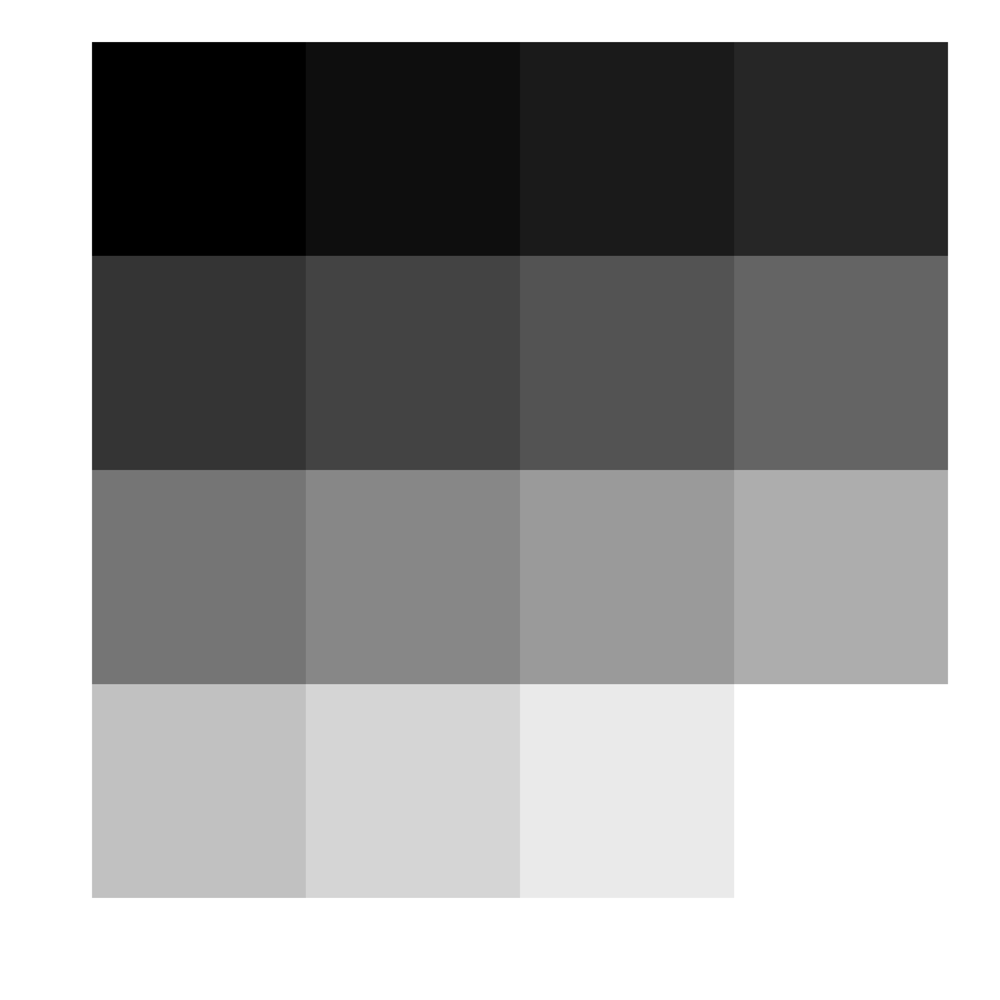

```{r setup, include=FALSE}
knitr::opts_chunk$set(echo = TRUE, warning = FALSE, message = FALSE, fig.height = 4, fig.width = 4, fig.align = "center")
```


```{r, echo=FALSE}
# required packages
library(bookdown)
library(imager)
library(pracma)
library(mosaic)
library(mosaicCalc)
library(tidyverse)
library(knitr)
library(kableExtra)
library(pathmapping)
```


# Introduction


This is a computational modeling project, which involves the estimation of a nodule area from its X-ray image. It involves interactively sampling the nodule boundary, estimating the area of the polygon formed by the sampled points, and fitting a circle to the sampled nodule points. This project can be scaffolded into the following components: determining the X-ray image dimensions, adding a coordinate system to the X-ray image, manually sampling the nodule boundary from the X-ray image, recording the $x$- and $y$-coordinates of the sampled points, creating a scatterplot of the sampled nodule boundary, computing the area of the polygon formed by the sampled points, fitting a circle to the sampled points using least squares, and transforming the circle to fully contain the lung nodule. The project uses images as matrices of pixel values, the least squares method, discretization of curves and 2D plotting.

In this project report, we implement all computations and visualizations using \textsf{R} and R Markdown in RStudio, as well as a number of R packages, [@chambers;@rmarkdown;@allaire2021]. We suggest that the students use the **RStudio Cloud**, @RStudioCloud, rather than installing \textsf{R}, RStudio and additional R packages on their computers.

We recommend the projects to be introduced to the students by scaffolding the mathematical ideas and coding procedures needed for them to work through the different steps that comprise the projects. Prior programming experience in \textsf{R} is not required, but in this case the students are expected to learn the basics of \textsf{R} and R Markdown. 


# Technology Framework

We recommend using [**R Markdown**](https://rmarkdown.rstudio.com/lesson-1.html) notebooks in [**RStudio**](https://www.rstudio.com/products/rstudio/) for all computations and visualizations with \textsf{R}. 

RStudio supports R Markdown documents through the **knitr** package. The first time you try to create an R Markdown document in RStudio, you are prompted to install all required packages, including the **knitr** package, and then you can create an R Markdown document and be able to knit it into a pdf or html output, as well as a word document, if you have MS Word installed.

Working with R Markdown documents allows one to unify plain text narrative, mathematical expressions typeset in \LaTeX\, as well as \textsf{R} and Python code (using the **reticulate** package, @ushey. Another advantage is that it creates fully reproducible, publication quality project reports, presentations and papers. 

The following software installers are available for Windows, Mac, and Linux:

- \textsf{R} installers: \url{http://cran.stat.ucla.edu/}
- RStudio installers: \url{https://www.rstudio.com/}

A cloud-based option (free and paid) for computing with RStudio is provided by the [**RStudio Cloud**](https://rstudio.cloud), @RStudioCloud, which also offers an instructor's account for creating virtual classrooms. RStudio Cloud is expected to release in 2022 a new collaboration feature for shared projects in the RStudio Cloud that will be very much like working in Google Docs. 

RStudio also offers an \textsf{R} interface to Python via the **reticulate** \textsf{R} package, which provides a comprehensive set of tools for interoperability between Python and \textsf{R}, @ushey. Thus, one can use both \textsf{R} and Python chunks of code in the same R Markdown document, combining the power of both. With R Markdown, one can even create websites, blogs and books, using the **blogdown** and **bookdown** packages. For more details, see the resources tab on the **RStudio** website, @allaire2021.  

Another great cloud-based computing environment is [**CoCalc**](https://cocalc.com), @stein, which offers free and paid accounts for online computing using SageMath, \textsf{R}, Python, Julia, Octave, etc. CoCalc also offers document authoring capabilities using Jupyter Notebooks based on Markdown and \LaTeX\. 

In addition to base \textsf{R}, we use several R packages such as **mosaic**, **mosaicCalc** and **ggformula** [@pruim2017; @kaplan2020; @kaplan2021] developed by **Project Mosaic**, @kaplan, which is _"a community of educators working to develop a new way to introduce mathematics, statistics, computation and modeling to students in colleges and universities"_. 

For the **mosaic** collection of packages, we recommend installing the developmental version of the **Zcalc** package from its GitHub repository, which installs the entire collection of mosaic-related packages. At the time of writing, we are using the developmental GitHub version 0.5.5 of the **mosaicCalc** package. Installing packages from GitHub is done using the **remotes** package. In particular, the **Zcalc** package can be installed from its GitHub repository with the command:

```{r, eval=FALSE, echo=TRUE}
remotes::install_github("dtkaplan/Zcalc")
```


We use the **tidyverse** collection of packages developed by RStudio, and specifically **ggplot2** for visualizations and **dplyr** for data analysis, [@wickham2021a;@wickham2021]. We also use the **imager** package for reading and manipulating images, and the **knitr** package for printing tables and including graphics. 

We recommend the following resources to learn the basics of \textsf{R}: [@braun2021; @wickham2017; @cornelissen2022], and R Markdown: [@rmarkdown; @xie2022; @grolemund2021]. 

The reader can find additional resources on computational-problem solving with \textsf{R} in the following references [@kaplan2015; @jones2014; @benakli2017; @kostadinov2019]. 


# Estimating the Area of a Lung Nodule from an X-ray Image


```{r tumor, echo=FALSE, out.width = "25%", fig.cap="A circular lung nodule on an X-ray image."}

```

A lung nodule is a circular-shaped area, which is denser than normal lung tissue. It shows up as a white spot on an X-ray or a CT scan; see Figure \@ref(fig:tumor). 

The lung nodule usually represents a benign tumor such as a granuloma or hamartoma, but in around 20\% of cases it represents a malignant cancer. Lung nodules can also occur in immune disorders, such as rheumatoid arthritis. If the patient has a history of smoking or the nodule is growing, the possibility of cancer may need to be excluded through further radiological studies and interventions, possibly including surgical removal. 

The goal of this project is to estimate the area of a lung nodule from its X-ray image. Knowing the size of the nodule would be valuable information for the medical team that may be planning a surgical removal of the nodule or a medical treatment. 


## Representing an Image as a Matrix

Images are represented as 4D arrays. The four dimensions are labelled $x$, $y$, $z$, $c$. The first two are the usual spatial dimensions, the third one usually corresponds to depth (time), if there are frames at several time points, and the fourth one is for color. In our analysis, we use only the first two dimensions since we have a single frame (no time dependence), and we consider a grayscale image, so we are not interested in color. 

In general, an image is just an $m\times n$ matrix $X=(x_{ij})$ of pixels, where the value of the pixel $x_{ij}$, in position $(i,j)$, is represented by an integer intensity $0 < x_{ij} < W$, using a gray scale from 0 (black) to $W$ (white), where the typical grayscale resolution is given by a value of $W=255$. However, some image processing packages use the normalized interval $[0,1]$ for the range of possible pixel values, and we assume this is the case now. Thus, we think of an image $X$ as a matrix $X=(x_{ij})$ with entries in $[0,1]$. Keep in mind that our images are still 4-dimensional, but the last two dimensions are flat. 

```{r, eval=FALSE, echo=FALSE, fig.height=2, fig.width=2}
X<-0:15/16 # 16 numbers in (0,1)
dim(X) <- c(4,4) # reshape the vector into a 4 by 4 matrix
knitr::kable(X, booktab=TRUE)
X <- as.cimg(X)
plot(X, interpolate=FALSE, axes = FALSE)
```

Below is an example of a matrix of 16 pixel values and the corresponding grayscale image, shown in Figure \@ref(fig:ex1). 

\begin{equation}
X =
\begin{bmatrix}
0.0000	& 0.2500	& 0.5000	& 0.7500 \\
0.0625	& 0.3125	& 0.5625	& 0.8125 \\
0.1250	& 0.3750	& 0.6250	& 0.8750 \\
0.1875	& 0.4375	& 0.6875	& 0.9375 \label{eq:X}
\end{bmatrix}
\end{equation}


```{r ex1, echo=FALSE, out.width = "30%", fig.cap="The grayscale image of the matrix $X$ of pixel values."}

```


```{r imgpix, fig.height=4.5, fig.width=3.5, fig.cap="The X-ray image as a matrix of pixels. Source: Google Images."}
img <- load.image("nodule.png") # with imager
plot(img, xlim=c(0,ncol(img)), ylim=c(nrow(img),0))
```


In this project, we work with the X-ray image (saved as a png file), shown in Figure \@ref(fig:imgpix), which has `r dim(img)[1]` rows of pixels and `r dim(img)[2]` columns of pixels, for a total of `r format(dim(img)[1]*dim(img)[2], big.mark=",")` pixels. Note that we position the image on a coordinate system in such a way that the top-left vertex of the image is placed at the origin of the coordinate system. 

We should keep in mind that whatever we do mathematically with matrices can be also done with images since they are represented by matrices. This could be the inspiration for exciting explorations in linear algebra done on images. For example, we can apply mathematical functions elementwise to the matrix representing the lung nodule image, shown in Figure \@ref(fig:imgpix). It is interesting to observe how the trigonometric transformation in \@ref(eq:trig), switches light to dark regions and vice versa. The result is shown in Figure \@ref(fig:trig), and we give below the plotting function. This should not be surprising though, given the wave nature of the cosine function. 

\begin{equation}
X \to \cos(2X) \label{eq:trig}
\end{equation}

```{r trig, fig.height=4.5, fig.width=3.5, fig.cap="The trigonometric transformation $\\cos(2X)$ applied to the X-ray image $X$."}
plot(cos(2*img), xlim=c(0,ncol(img)), ylim=c(nrow(img),0))
```


## Sampling the Tumor Boundary

We have an X-ray image of the lung nodule as a png image file, and the first step is to read the image file and plot it on a coordinate system. Depending on the computing environment that you are using, you can work with either pixels or other units, such as centimeters. Usually, on a regular X-ray image, one pixel corresponds to 175 $\mu \textrm{m}$ (microns) and since 1 $\mu \textrm{m} = 10^{-4} \, \textrm{cm}$, we can approximate the image dimensions in $\textrm{cm}$ using the scaling: 

\begin{equation}
\#\textrm{pixels} \times 175 \times 10^{-4} \, \textrm{cm}. (\#eq:dim)
\end{equation}


```{r, echo=FALSE}
# image dimensions converted to cm, assuming 1 pixel measures 175 microns
ydim <- nrow(img)*175*1e-4 # in cm, assuming 1 pixel measures 175 microns
xdim <- ncol(img)*175*1e-4 # in cm, assuming 1 pixel measures 175 microns
img_dim<-c(xdim, ydim) # image dimensions in cm
```

We can find the dimensions of the X-ray image, first in pixels, and then in $\textrm{cm}$, by using the conversion formula \@ref(eq:dim). Keep in mind that the dimensions of the image in pixels are given by the number of rows of the image as a matrix, for the $y$-dimension, and by the number of columns for the $x$-dimension. In this way, we find that the dimensions of the image in centimeters are $`r img_dim[1]` \, \textrm{cm} \times `r img_dim[2]` \, \textrm{cm}$. 

We can then use the image dimensions to plot the X-ray image in a coordinate system, using the computed dimensions in centimeters, as shown in Figure \@ref(fig:xray). The unit conversion may be done at a later stage, but it has to be done if we want to estimate the nodule area in $\textrm{cm}^2$. We provide the code below that generates Figure \@ref(fig:xray), using the `rasterImage()` function to add an image to an empty plot. 

```{r xray, echo=TRUE, fig.height=4.5, fig.width=3.5, fig.cap="The X-ray image in a coordinate system, where the units are centimeters."}
# create an empty plot with the image dimensions in cm
plot(NULL, type="n", xlim=c(0, xdim), ylim=c(ydim, 0), xlab="", ylab="", xaxs = "i",
     yaxs = "i", cex.axis=0.7)
# embed the image into the empty plot according to the specified dimensions
rasterImage(img, xleft=par("usr")[1], ybottom=par("usr")[3], 
            xright=par("usr")[2], ytop=par("usr")[4])
```

The next step is to interactively sample some points from the nodule boundary. We have done this using RStudio and the `locator()` R function from base graphics. 

In general, a manual sampling can be implemented using a built-in function, from your computing environment of choice, to capture a mouse click. Typically, such a function records the coordinates of every point on the plot where you click with the computer mouse. This is how we can get a list with the $x$- and $y$-coordinates of the sampled points along the nodule boundary. 

We provide below the code for interactively sampling points from the boundary of the nodule, which has to be run from a **plain R script in RStudio** so that the manual sampling can be done in the RStudio Plots window. For this purpose, we use the R function `locator()` to manually sample points from the nodule boundary. The code below allows us to sample 22 points from the X-ray image, once we run the code chunk above to display the X-ray image in the RStudio plotting window, and record their $x$- and $y$-coordinates into a csv file. 

```{r, eval=FALSE, echo=TRUE}
# sample points inside the RStudio Viewer
coords <- locator(n=22, type="o") 
# write the x and y coordinates of the sampled points in a csv file
write.csv(coords,file="xy.csv", row.names=FALSE)
```

We sample 22 points from the boundary of the nodule, and since have their $x$- and $y$-coordinates, we can plot them on the top of the X-ray image using the same coordinate system, as shown in Figure \@ref(fig:sample). It is very important to keep in mind that we have to use the same coordinate system for the X-ray image, when we sample the points from the nodule boundary, and when we plot them on the top of the X-ray image, otherwise the sampled points will be shifted relative to the nodule boundary. 

```{r sample, echo=FALSE, fig.height=4.4, fig.width=3.4, fig.cap="The points sampled from the nodule boundary, superimposed on the X-ray image, in the same coordinate system, in units of centimeters."}
xycoords <- read.csv("xy.csv")
# create an empty plot with the image dimensions in cm
plot(NULL, type="n", xlim=c(0, xdim), ylim=c(ydim, 0), xlab="", ylab="", xaxs = "i", yaxs = "i", cex.axis=0.7)
# embed the image into the empty plot according to the specified dimensions
rasterImage(img, xleft=par("usr")[1], ybottom=par("usr")[3], xright=par("usr")[2], ytop=par("usr")[4])
points(xycoords$x, xycoords$y, pch=20, col="gray", cex=0.1)
```


## Computing the Area of the Polygon with the Shoelace Formula

We can compute the area of the polygon formed by the points sampled from the nodule boundary using the **Shoelace formula**, also known as the **Surveyor's area formula**, given below:  

\begin{equation}
\textrm{Area} = \frac{1}{2} \Big| 
\begin{vmatrix}
x_1 & x_2 \\
y_1 & y_2
\end{vmatrix}
+
\begin{vmatrix}
x_2 & x_3 \\
y_2 & y_3
\end{vmatrix}
+ \cdots +
\begin{vmatrix}
x_{n-1} & x_n \\
y_{n-1} & y_n
\end{vmatrix}
+
\begin{vmatrix}
x_n & x_1 \\
y_n & y_1
\end{vmatrix}
\Big|, (\#eq:surveyor)
\end{equation}

where $x_1, x_2,\ldots, x_n$ are the $x$-coordinates, and $y_1, y_2,\ldots, y_n$ are the $y$-coordinates of the polygon vertices. 

By expanding the $2\times 2$ determinants in \@ref(eq:surveyor), we obtain an equivalent form:

\begin{equation}
\textrm{Area} = \frac{1}{2} \Big| \sum_{i=1}^{n-1} x_i y_{i+1} - \sum_{i=1}^{n-1}x_{i+1}y_i + x_n y_1 - x_1 y_n \Big|. (\#eq:shoelace)
\end{equation}

It is a good mathematical exercise to derive the Surveyor's area formula. A good reference for its derivation can be found in @braden1986. 

A good computational exercise is to implement the Surveyor's formula \@ref(eq:surveyor) using a `for loop`, which is illustrated in the code chunk below. 

```{r}
xycoords <- read.csv("xy.csv")
x<-xycoords$x # vector of x-coordinates of polygon vertices
y<-xycoords$y # vector of y-coordinates of polygon vertices
n<-length(x) # length of vector
area<-0 # initialize area
for (i in 1:(n-1)){
  area <- area + x[i]*y[i+1] - x[i+1]*y[i]
}
# polygon area
area <- 0.5*abs(area + x[n]*y[1] - x[1]*y[n])
```

Note that the `for loop` implements the difference of the sums $\sum_{i=1}^{n-1} x_i y_{i+1} - \sum_{i=1}^{n-1}x_{i+1}y_i$. 

Thus, according to the Shoelace formula, the area of the polygon formed by the sampled points  is  $\texttt{area}=`r round(area,2)`$ $\textrm{cm}^2$. To confirm that our computations are correct, we can use the **pathmapping** package, which has the `Shoelace()` function for computing the area. 

```{r}
library(pathmapping)
poly <- cbind(x,y) # x and y coordinates of the polygon vertices
polyarea <-shoelace(poly) # polygon area
```

We implement this check above, and it gives $\texttt{polyarea} = `r round(polyarea,2)` \, \textrm{cm}^2$, which confirms our result. 

We can also implement the Shoelace version \@ref(eq:shoelace) using a **vectorized programming** approach rather than a `for loop`. Getting used to a functional programming approach based on vectors and matrices and functions applied to them is a very useful coding skill to develop. The key idea here is to represent the two sums in \@ref(eq:shoelace) in terms of the vectors $\mathbf{x}$ and $\mathbf{y}$ consisting of the $x$- and $y$-coordinates of the polygon vertices, respectively. 

Let $\mathbf{x} = (x_1,x_2,\ldots,x_n)$ and $\mathbf{y} = (y_1,y_2,\ldots,y_n)$ be the vectors of $x$- and $y$-coordinates of the $n$ polygon vertices. Then, the first sum in \@ref(eq:shoelace) can be represented in terms of the vectors $\mathbf{x}$ and $\mathbf{y}$ as follows:

\begin{equation}
\sum_{i=1}^{n-1} x_i y_{i+1} = \texttt{sum(x[1:(n-1)]*y[2:n])}, (\#eq:sum1)
\end{equation}

where the notation `x[1:(n-1)]` means the subvector of $\mathbf{x}$ formed by the first $n-1$ elements of $\mathbf{x}$, that is, all elements of $\mathbf{x}$ except for the last one, and `y[2:n]` means the subvector of $\mathbf{y}$ formed by all elements of the vector $\mathbf{y}$, except for the first one. The multiplication operator `*` is defined as acting elementwise on the two vectors, which have the same length of $n-1$. Thus, the elementwise product `x[1:(n-1)]*y[2:n]` results in a vector of size $n-1$ where the components are obtained by elementwise multiplication. Finally, the expression `sum(x[1:(n-1)]*y[2:n])` simply sums the elements of the vector resulting from the product and it returns the sum on the left-hand side of \@ref(eq:sum1). 

Similarly, we can express the second sum in \@ref(eq:shoelace) by reversing the roles of the $x$- and $y$-coordinates, which represents the "shoe lacing":

\begin{equation}
\sum_{i=1}^{n-1}x_{i+1}y_i = \texttt{sum(x[2:n]*y[1:(n-1)])}. (\#eq:sum2)
\end{equation}

These observations lead us to a vectorized approach for computing the area of the polygon:

```{r}
area<-0.5*abs(sum(x[1:(n-1)]*y[2:n]) - sum(x[2:n]*y[1:(n-1)]) + x[n]*y[1] - x[1]*y[n])
```

The polygon area computed above is $\texttt{area} = `r round(area,2)` \, \textrm{cm}^2$, just as before. 

A good exercise in complex algebra is to rewrite the Surveyor's formula \@ref(eq:surveyor) in a complex form. We can represent the $k$th polygon vertex on the plane as the complex number $z_k = x_k + i\,y_k$, where $i=\sqrt{-1}$ is the imaginary unit. 

```{r polygon, fig.height=2.8, fig.width=2.8, fig.align='center', fig.cap="The polygon formed by the sampled points, where the point C is the center of mass of the polygon."}
gf_point(y ~ x, col="blue", size=0.6) %>%
  gf_point(col="blue", size=0.3, geom="polygon", fill=NA) %>% 
  gf_point(mean(y) ~ mean(x), col="hotpink", size=0.8) %>% 
  gf_text(mean(y) ~ mean(x), label="C", col="hotpink", vjust = 1,nudge_y = 0.2) %>% 
  gf_labs(x="x", y="y")
```

In Figure \@ref(fig:polygon), we show the sampled points and the polygon they form. In complex coordinates, the Shoelace formula has the following complex form:  

\begin{equation}
\text{Area} = \frac{1}{2} \Big| \text{Im}\left (\sum_{k=1}^n z_k \bar{z}_{k+1} \right) \Big|, 
\end{equation}

where the complex vector $\mathbf{z}=(z_k)_{k=1}^{n+1}$ is defined to be periodic modulo $n$, in the sense that $z_{n+1}=z_1$, and the complex elements $(z_k)_{k=1}^n$ represent the $n$ polygon vertices. Here $\bar{z}_{k+1}$ is the complex conjugate, and $\text{Im}()$ represents taking the imaginary part. We can implement this complex form of the Shoelace formula by first computing the sum, then taking the imaginary part of the sum followed by its absolute value, and then dividing the result by 2: 

\begin{equation}
\sum_{k=1}^n z_k \bar{z}_{k+1} = \texttt{sum(z[1:n]*Conj(z[2:(n+1)]))}. (\#eq:complexsum)
\end{equation}

This leads to a vectorized approach for computing the polygon area in a complex form:

\begin{equation}
A = \texttt{0.5*abs(Im(sum(z[1:n]*Conj(z[2:(n+1)]))))}. (\#eq:complexarea)
\end{equation}


```{r, eval=TRUE, echo=TRUE}
z <- x + 1i*y # vector of complex numbers representing the polygon vertices
n<-length(x) # length of vector x
z <-c(z,z[1]) # periodic extension of z mod n
area <- 0.5*abs(Im(sum(z[1:n]*Conj(z[2:(n+1)])))) # complex form of Shoelace formula
```

The complex form of the Shoelace formula confirms that $\texttt{area} = `r round(area,2)` \, \textrm{cm}^2$. 


## The Surveyor's Method for Estimating a Circle from Data

The Surveyor estimates first the location of the center of the circular area. From this point we measure the distances to each one of the polygon vertices that form the boundary of the circular area. Then the distances are averaged to obtain $\bar{r}$ as an average radius of a circle approximating the circular area. The circular area is then approximated by:

\begin{equation}
A=\pi \bar{r}^2. (\#eq:Rbar)
\end{equation}

We can find the center of the polygon forming the circular area by computing its **center of mass** $C=(\bar{x},\bar{y})$, where $\bar{x}$ is the average of the $x$-coordinates of the polygon vertices, and $\bar{y}$ is the average of the $y$-coordinates of the $n$ polygon vertices:

\begin{equation}
\bar{x} = \frac{1}{n}\sum_{k=1}^n x_k, \quad \bar{y} = \frac{1}{n}\sum_{k=1}^n y_k,
\end{equation}

where $n=22$ is the number of data points sampled from the nodule boundary. The center of mass $C$ of the polygon is shown in Figure \@ref(fig:polygon). 

We can compute the average radius $\bar{r}$ by computing the distance $r_k$ from the center of mass $(\bar{x},\bar{y})$ to each polygon vertex $(x_k,y_k)$ using the Euclidean distance:

\begin{equation}
r_k = \sqrt{(x_k-\bar{x})^2 + (y_k - \bar{y})^2}.
\end{equation}

We can compute all these $n=22$ distances at once using the `mutate()` function from the **dplyr** package. 

```{r, eval=TRUE, echo=TRUE}
xycoords <- read.csv("xy.csv") # read the x and y coordinates of sampled points
xyrdata <- mutate(xycoords, r = sqrt((x - mean(x))^2 + (y - mean(y))^2))
```

Note that in the `mutate()` function, the formula for `r` is applied to each element of the `x` and `y` columns and the result is a new column labeled `r`, of the same size, but `mean(x)` and `mean(y)` are the averages obtained from applying the `mean()` function to the entire columns `x` and `y`, thus giving us $\bar{x}$ and $\bar{y}$, being the $x$- and $y$-coordinates, respectively, of the center of mass. In Table \@ref(tab:table1), we display the beginning of `xyrdata`. 

```{r table1, echo=FALSE}
knitr::kable(xyrdata[1:5,], booktabs=TRUE, caption = "The first 5 rows of the \\texttt{xyrdata}.") %>% 
  kable_styling(position = "center") %>% 
  kable_styling(latex_options = "HOLD_position")
```

Averaging the vector `r` in the dataframe `xyrdata` gives us the average radius $\bar{r}$. We can visualize the circle $(x-\bar{x})^2 + (y-\bar{y})^2 = \bar{r}^2$ with center $(\bar{x},\bar{y})$ and radius $\bar{r}$, and superimpose it over the data points. For this purpose, we use the parametric equations of the circle to generate the vectors of $x$- and $y$-coordinates for a large number of points on the circle, using a vector of values for the parameter $t$.  

\begin{align}
x & = \bar{x} + \bar{r}\cos(t) \label{eq:param1}, \\
y & = \bar{y} + \bar{r}\sin(t) \label{eq:param2}, \\ 
t & \in [0,2\pi]. \nonumber
\end{align}

This is implemented in the code below, where the dataframe `circle` contains the vectors of $x$- and $y$-coordinates of points on the circle, generated from \@ref(eq:param1)-\@ref(eq:param2), for a vector of $t$ values. Note that `with(xyrdata,...)` makes the variables `x`, `y` and `r` in the dataframe `xyrdata` available for computing, and that is why we can compute `mean(x)`, `mean(y)` and `mean(r)`. 
             
```{r}
circle <- with(xyrdata, tibble(t = seq(0, 2*pi, len=100), x = mean(x) + mean(r)*cos(t), 
                               y = mean(y) + mean(r)*sin(t)))
```

Now, we can create a scatterplot of the sampled points and superimpose over it a plot of the circle using the data in the dataframe `circle`. Figure \@ref(fig:circle1) shows the sampled points and the circle, where we use the `ggplot()` function from the **ggplot2** package. 

```{r circle1, fig.height=3, fig.width=3, fig.align='center', fig.cap="The Surveyor's estimated circle superimposed on the sampled points."}
ggplot(data=xyrdata, aes(x=x,y=y)) +
  geom_point(col="black", size=0.8) +
  geom_polygon(col="gray", size=0.4, fill="gray88", alpha=0.7) +
  geom_point(aes(x=mean(x),y=mean(y)), col="hotpink", size=0.8) +
  geom_path(data=circle, aes(x=x,y=y), col="hotpink") +
  coord_fixed()
```


We can compute the parameters of the circle by summarizing the dataframe `xyrdata` and computing the average radius $\bar{r}$ and the center of the circle being the center of mass of the data points $(\bar{x},\bar{y})$. 

```{r}
stats <- xyrdata %>% summarize(rbar=mean(r), xbar=mean(x), ybar=mean(y))
```


```{r, echo=FALSE}
Area <- pi*stats$rbar^2
```

The area of the approximating circle is $\text{Area}=\pi\bar{r}^2 =`r round(Area,2)` \, \textrm{cm}^2$. 

Figure \@ref(fig:circle1) shows that the Surveyor's estimated circle is not a great fit for the sampled points that form the polygon representing the circular area to be estimated. 


## Fitting a Circle to the Sampled Points Using Nonlinear Least Squares

Even though the Surveyor's method for estimating a circle does not produce a good fit, we can still use it to initialize a more sophisticated approach to fitting a circle to the nodule boundary by using **non-linear least squares**. The equation of a circle with center at $(x_0,y_0)$ and radius $r$ is given by:

\begin{equation}
(x-x_0)^2 + (y-y_0)^2 = r^2. 
\end{equation}

If all data points $(x_j,y_j)$ for $j=1,2,\ldots,n$ ($n=22$) were on the circle, we would have $n$ equations:

\begin{equation}
(x_j - x_0)^2 + (y_j - y_0)^2 = r^2, \, j=1,2,\ldots,n.
\end{equation}

However, clearly the data points are not located on a circle so we cannot have all of these equations satisfied. The best thing we can do is to minimize the **sum of squared errors** (SSE), where the $j$th error is given by $e_j=(x_j - x_0)^2 + (y_j - y_0)^2 - r^2$:

\begin{equation}
\text{SSE}(x_0,y_0,r) = \sum_{j=1}^n ((x_j - x_0)^2 + (y_j - y_0)^2 - r^2)^2. \label{eq:SSE}
\end{equation}

This now becomes an optimization problem since we want to minimize the function $\text{SSE}(x_0,y_0,r)$ with respect to the model parameters $x_0$, $y_0$ and $r$. Since the equation of the circle depends quadratically on the circle parameters, this is an example of **nonlinear least squares**. Minimizing a function of three variables is no easy task, but we can use a general-purpose optimizer such as the `optim()` function from base R. It is based on Nelder-Mead, Newton and conjugate-gradient algorithms, but it also has an option for simulated annealing. The `optim()` function takes two arguments: the first one is a vector with initial guesses for all model parameters, and the second one is the R function to be minimized (the default) with respect to these parameters. 

For the initial guesses, we use the Surveyor's estimates $\bar{r}$ and $(\bar{x},\bar{y})$ for the radius and center, respectively. The objective function to be minimized is the $\text{SSE}(x_0,y_0,r)$, and it has to be defined as an R function with a single, vector argument whose components are the model parameters. We use in the function the previously defined vectors `x` and `y` of the $x$- and $y$-coordinates of the sampled points, and we implement the right-hand side of \@ref(eq:SSE) in a vectorized way, as shown in the code chunk below. 

```{r}
SSE<-function(params) sum(((x-params[1])^2 + (y-params[2])^2 - params[3]^2)^2)
```

Note that the function argument `params` is a vector whose elements are the circle parameters, with `params[1]` being $x_0$, `params[2]` being $y_0$, and `params[3]` being $r$. Supplying the vector of initial guesses for the model parameters in the correct order and the function `SSE` is all that is needed to minimize (the default optimization) the sum of squared errors.

```{r}
out<-optim(c(stats$xbar,stats$ybar,stats$rbar), SSE) # minimizer
```

The result `out` is a list with several elements, but we use only the first two. The first element `par` is the vector of fitted parameters, the first two parameters being the $x$- and $y$-coordinates of the center of the fitted circle, and the third parameter being the radius of the best fit circle. We can extract the first element of the list with `out$par`, which returns the vector of fitted parameters. In particular, we get:

\begin{equation}
x_0 = `r round(out$par[1],4)`, \, y_0 = `r round(out$par[2],4)`, \, r = `r round(out$par[3],4)`, \, \text{SSE}(x_0,y_0,r) = `r round(out$value,4)`.
\end{equation}


```{r, echo=FALSE}
lsArea <- pi*out$par[3]^2
```

The area of the circle of best fit is then $\text{Area}=\pi r^2 = `r round(lsArea,2)` \, \textrm{cm}^2$. 

The second element is the minimum value of the function, which is `r round(out$value,2)`, and it would have been zero if all points lied on a circle. We can now create a dataframe `lscircle` with the $x$- and $y$-coordinates of the circle of best fit using the fitted circle parameters. This is done with the code below, where `with(out,...)` makes the variables in the list `out` available for computing without having to extract them from the list. The `tibble()` function creates the dataframe with three variables `t`, `x` and `y`, where `t` is a vector of $t$ values in the interval $(0,2\pi)$ of length 100, and the vectors of $x$- and $y$-coordinates are generated by the parametric equations of the circle of best fit using the optimal values of the fitted parameters. 

```{r}
lscircle<-with(out, tibble(t = seq(0, 2*pi, len=100), x = par[1] + par[3]*cos(t), 
                               y = par[2] + par[3]*sin(t)))
```


In addition to the circle of best fit, we also want to stretch the radius of the fitted circle, keeping the center fixed, so that it contains all sampled points. We can do that by computing the vector of Euclidean distances between each sampled point and the center of the fitted circle, and then finding the maximum distance in this vector. This is done in the vectorized code below, where the resulting maximum distance is held in `rmax`. 

```{r}
rmax <- max(sqrt((xycoords$x - out$par[1])^2 + (xycoords$y - out$par[2])^2))
```


```{r, echo=FALSE}
minArea <- pi*rmax^2
```

Thus, the area of the smallest circle that contains all sampled points is $\text{Area}=`r round(minArea,2)` \, \textrm{cm}^2$. 

Just like before, we can create a dataframe `mincircle` with the $x$- and $y$-coordinates of this circle, containing all sampled points, centered at the same point as the fitted circle, but having a radius `rmax`. 

```{r}
mincircle <- tibble(t = seq(0, 2*pi, len=100), x = out$par[1] + rmax*cos(t), 
                               y = out$par[2] + rmax*sin(t))
```


Finally, we can visualize the sampled data points from the nodule boundary, and the polygon they form, and we can superimpose over them both circles, the circle of best fit and the smallest circle that contains all sampled points. We implement this visualization in Figure \@ref(fig:circle2) using the `ggplot()` function from the **ggplot2** package. 

```{r circle2, fig.height=3, fig.width=3, fig.align='center', fig.cap="The circle of best fit and the smallest circle containing all points sampled from the nodule boundary, and the polygon they form."}
ggplot(data=xyrdata, aes(x=x,y=y)) +
  geom_point(col="black", size=0.8) +
  geom_polygon(col="gray", size=0.4, fill="gray88", alpha=0.7) +
  geom_path(data=lscircle, aes(x=x,y=y), col="hotpink") +
  geom_path(data=mincircle, aes(x=x,y=y), col="deeppink") +
  coord_fixed()
```


We close this project with the final visualization in Figure \@ref(fig:final), where we superimpose on the X-ray image, both the points sampled from the nodule boundary, and the smallest circle that contains them all, stretched from the circle of best fit, keeping the center fixed. 

```{r final, fig.pos="h", echo=FALSE, fig.height=4.2, fig.width=4, fig.cap="The sampled points from the nodule boundary, superimposed on the X-ray image, along with the optimal circle containing the nodule, obtained from nonlinear least squares."}
xycoords <- read.csv("xy.csv")
# create an empty plot with the image dimensions in cm
plot(NULL, type="n", xlim=c(0, xdim), ylim=c(ydim, 0), xlab="", ylab="",  xaxs = "i", yaxs = "i", cex.axis=0.7)
# embed the image into the empty plot according to the specified dimensions
rasterImage(img, xleft=par("usr")[1], ybottom=par("usr")[3], xright=par("usr")[2], ytop=par("usr")[4])
points(xycoords$x, xycoords$y, pch=20, col="ghostwhite", cex=0.1)
points(mincircle$x, mincircle$y, pch=19, col="deeppink", cex=0.1)
```


## Random Search Optimization

The sum of squared errors \@ref(eq:SSE) used for the nonlinear least squares can be minimized using a **random search optimization** algorithm, as the one given below. 

\vspace{2mm}

```{r, echo=TRUE, eval=TRUE}
set.seed(1111)
xycoords <- read.csv("xy.csv")
x<-xycoords$x # vector of x-coordinates of polygon vertices
y<-xycoords$y # vector of y-coordinates of polygon vertices
# Sum of squared errors using the vectors of x and y coordinates
S<-function(A,B,R) sum(((x-A)^2 + (y-B)^2 - R^2)^2)
S <- Vectorize(S) # vectorized function
# Initialize the random search using Surveyor's circle
a<-26.45 # lower limit of A
b<-26.65 # upper limit of A
c<-10.10 # lower limit of B
d<-10.30 # upper limit of B
w<-1.50  # lower limit of R
z<-1.70  # upper limit of R
N<-1e5   # number of iterations
# begin random search
Amin<-runif(1,a,b) # random number from U(a,b)
Bmin<-runif(1,c,d) # random number from U(c,d)
Rmin<-runif(1,w,z) # random number from U(w,z)
Smin<-S(Amin,Bmin,Rmin) # objective function to minimize
for (n in 1:N){
  A<-runif(1,a,b) # update A with a random number from U(a,b)
  B<-runif(1,c,d) # update B with a random number from U(c,d)
  R<-runif(1,w,z) # update R with a random number from U(w,z)
  Sval<-S(A,B,R)  # update objective function
  if (Sval < Smin) {
    Amin<-A       # update parameter A
    Bmin<-B       # update parameter B
    Rmin<-R       # update parameter R
    Smin<-Sval    # update function value
  }
}
```


\vspace{2mm}

To initialize the random search optimization, we use the parameters of the circle estimated by the Surveyor's method, and we take small intervals around them where we do the random search to find the minimum of the objective function. The random search optimization returns the optimal values for the parameters of the circle of best fit: $x_0 = `r round(A,4)`, \, y_0 = `r round(B,4)`, \, r = `r round(R,4)`, \, S=`r round(Smin,4)`$.


